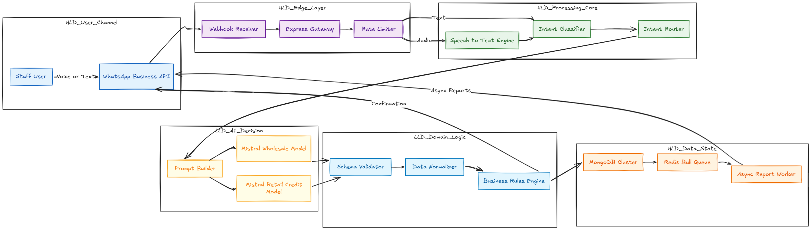

# Wasio - Intelligent Enterprise Operations Bot


## 🚀 Overview

**Wasio Ops** is a sophisticated, AI-driven ERP system that operates entirely through WhatsApp. It serves as the central nervous system for business operations, automating sales tracking, inventory management, credit keeping ("Hisab"), and wholesale order processing.

What sets this project apart is its ability to understand the *messy reality* of human communication. Whether a staff member sends a rapid-fire voice note in mixed Hindi/English or types a casual text about a sale, the system's multi-stage AI pipeline (Whisper + Mistral) parses, validates, and structures that data into a robust MongoDB ledger with near-perfect accuracy.

---

## 📖 Origin & Philosophy: AI for the Real World

**"AI was created to solve real-life problems, not just to generate text."**

The inception of **Wasio** came from a personal observation: I saw local shopkeepers suffering daily. They were drowning in the chaos of manual bookkeeping—scribbling "hisab" (credit/debit) on scraps of paper, losing track of inventory, and facing a compounding loss of time that directly ate into their productivity and profits. I realized that for these users, a complex dashboard was useless. They needed something that worked *at the speed of their business*.

### The Development Journey

I conceptualized and developed this project in its entirety, transforming a personal vision into a robust enterprise solution. As the sole architect and engineer, I have independently built every component of the system, ensuring that each layer—from the AI pipeline to the database schema—is optimized for the speed and reliability required by real-world business operations.

This project isn't just code; it's a testament to solving a gritty, real-world productivity crisis with sophisticated, resilient engineering.

---

## 🏗 System Architecture

The system follows a micro-service inspired event-driven architecture, using Meta's Webhook API as the primary ingress.



### Key Architectural Decisions

*   **Hybrid AI Pipeline**: We use **OpenAI Whisper Large v3 Turbo** for state-of-the-art speech recognition (handling distinct Indian accents/dialects) and pipe it into **Mistral AI** for semantic extraction. This allows users to speak naturally ("500 ka chawal aur 200 ka udhaar") without learning complex command syntax.
*   **Self-Healing Database Connections**: Implemented a custom `ConnectionManager` that handles MongoDB topology changes, network partitions, and timeouts gracefully, ensuring the bot effectively "wakes up" and reconnects without manual intervention.
*   **Strict Validation Layer**: LLMs can hallucinate. I built a robust sanitization layer that validates AI-generated JSON against rigid schemas before it ever touches our database, preventing data corruption.

---


## 🛠 Tech Stack

| Category | Technology | Key Role & Rationale |
| :--- | :--- | :--- |
| **Core Backend** | Node.js & Express | Async capabilities for handling concurrent webhooks. |
| | MongoDB (Mongoose) | Flexible schema design for evolving data models without downtime. |
| **AI & Processing** | Gradio Client | Interfaces with high-performance ML inference servers. |
| | Mistral AI (7B) | Fine-tuned for "Hinglish" understanding and entity extraction. |
| | OpenAI Whisper v3 | High-accuracy voice-to-text transcription. |
| | ffmpeg | Transcoding WhatsApp audio formats for AI compatibility. |
| **Infrastructure** | Helmet & Rate Limiting | Protection against DDoS and header-based attacks. |
| | Bull Queue (Redis) | Asynchronous management of heavy AI processing jobs. |
| | Puppeteer | On-the-fly generation of PDF invoices and reports. |

---


## ⚡ Key Features

### 1. The "Hisab" Engine
Orchestrates complex credit and debit ledgers. Users can simply say *"Clear 500 from Raju's account"* and the system resolves the user, updates the balance, and sends a receipt.

### 2. Conversational Wholesale
Handles bulk entry of inventory.
*   *Input*: "Wholesale: 50kg rice at 40/kg selling 50/kg, 20L oil at 100 selling 120"
*   *Process*: AI splits this into multiple inventory records, calculates margins, and updates stock levels instantly.

### 3. Voice-First Operations
Recognizing that on-ground staff prefers speaking to typing, the bot accepts voice notes for *any* command, transcribing and executing them with the same precision as text.

---

## 🔧 Technical Highlights (Code Depth)

### Robust JSON Extraction
One of the biggest challenges was making the LLM output reliable JSON. I implemented a multi-pass cleaning strategy:

```javascript
// From Controllers/AiController.js
const mistralHandle = async (msg, flag) => {
  // ... (AI Prediction) ...
  
  // Clean potentially malformed JSON from LLM
  let cleanedData = rawData.replace(/<\/s>$/, '').trim()
    .replace(/\\"/g, '"')
    .replace(/"\{/g, '{'); // Fix nested stringification
    
  // Dual-strategy parsing: Try as Object, failover to Array of Strings
  try {
     const parsed = JSON.parse(cleanedData);
     // ... Validate ...
  } catch (error) {
     // Fallback recovery logic
  }
};
```

### Resilient Connections
Production uptime is non-negotiable. The `ConnectionManager` actively monitors the DB socket:

```javascript
// From MiddleWare/ConnectionManager.js
mongoose.connection.on('disconnected', () => {
  logger.checkpoint('MongoDB disconnected, attempting reconnection');
  setTimeout(() => {
    this.initialize().catch(console.error);
  }, 10000); // Exponential backoff strategy implemented
});
```

---

## 🚀 Getting Started

1.  **Clone the repository**
    ```bash
    git clone https://github.com/yourusername/lucknowi-arts-backend.git
    ```

2.  **Install Dependencies**
    ```bash
    npm install
    ```

3.  **Environment Setup**
    Create a `.env` file with your credentials:
    ```env
    MONGO_URI=mongodb+srv://...
    WEB_VERI_TOK=your_whatsapp_webhook_token
    TOK=your_whatsapp_api_token
    ```

4.  **Run the Server**
    ```bash
    npm start
    ```

---

## 🤝 Contribution

This is an open source system, will love your ideations and codes.

**Author**: Rehan Ansari 
*Building scalable systems with AI and resilience.*
